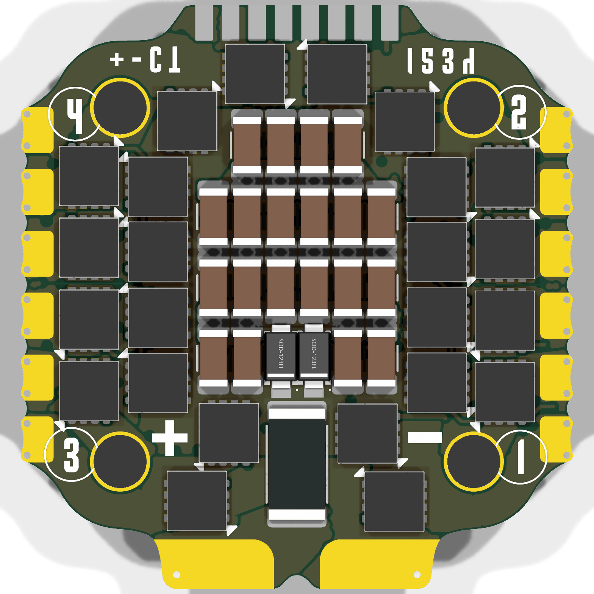
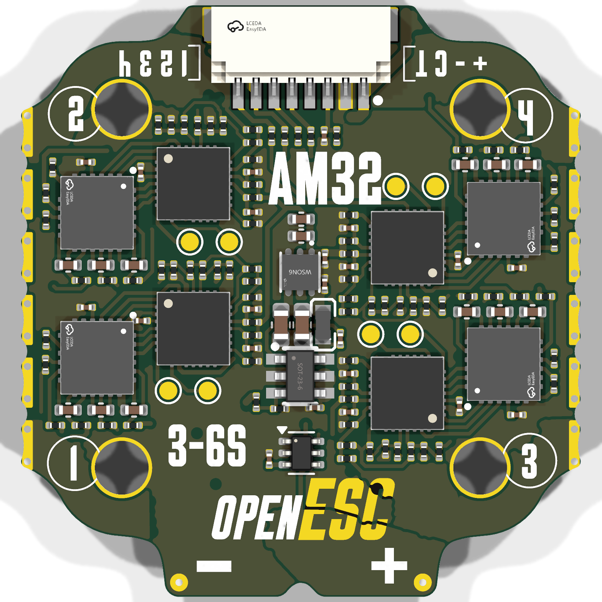

# OpenESC_20X20

<p>


</p>

Open-source 4-in-1 BLDC ESC with a 20 × 20 mm mounting pattern, built around four independent AT32F421 motor controllers running AM32. Six-layer, DShot over the standard 8-pin connector. Designed in KiCad for JLCPCB assembly.

Part of the incutec OpenDrone line (`incutec-hw/OpenESC_20X20`).

> A larger **[OpenESC-30x30](https://github.com/incutec-hw/OpenESC-30x30)** (30.5×30.5 mm) shares this design and mirrors this repo. The two differ only in board/mounting size and a few power-stage parts.

## Architecture

Four fully independent ESC channels share a common power input and telemetry connector. Each channel has its own MCU and gate driver; the high-current stage is six MOSFETs per channel (three half-bridges). This is the distributed-MCU AM32 4-in-1 topology rather than a single-MCU design. Values below are extracted from the KiCad design files (`hardware/4in1-mini.kicad_sch`, `hardware/ESC.kicad_sch`, `hardware/4in1-mini.kicad_pcb`) and the production BOM (`hardware/production/Rev2-20x20_bom.csv`).

| Block | Part | LCSC | Per board |
|---|---|---|---|
| Motor MCU | AT32F421G8U7 (QFN-28) | C2765098 | 4 |
| Gate driver | NSG2065Q (QFN-24) | C41414478 | 4 |
| Power MOSFETs | DOY180N03T PowerDI3333-8 | C49441966 | 24 (6 per channel) |

## Specifications

| Parameter | Value |
|---|---|
| Channels | 4 independent BLDC channels |
| MCU | AT32F421G8U7 (ARM Cortex-M4, QFN-28), one per channel |
| Gate driver | NSG2065Q (QFN-24, FD6288Q-compatible), one per channel |
| Power MOSFETs | DOY180N03T, 30 V, PowerDI3333-8, 24 total |
| Current sense | Board-level high-side: INA186A3IDCKR (100 V/V, SC-70-6) + 1× 0.2 mΩ 2512 shunt (Rsense1) in the +BATT feed → 20 mV/A → 165 A full-scale at 3.3 V ADC |
| Input | +BATT direct from connector/pads, 6S target |
| Input protection | 2× SMF24A-T13 TVS (24 V standoff) |
| Buck regulator | LMR54406DBVR (SOT-23-6) + FTC160808S4R7MBCA 4.7 µH inductor → +10 V gate-drive rail (FB 115k/10k, Vref 0.8 V → 10.0 V) |
| LDO | TLV76733DRVR (WSON-6) → +3V3 (MCUs, sensing), from +10 V |
| Signal protocol | DShot (4 independent signal lines, one per channel) |
| Firmware | AM32 (per-channel AT32F421 target, flashed individually) |
| PCB | 6-layer; outline ≈ 31.3 × 33.1 mm |
| Mounting pattern | 20 × 20 mm, 4× holes (M2) |

Current/voltage ratings are not printed on the design files. The input clamp is set by the SMF24A-T13 TVS (24 V standoff → 6S); the MOSFET (DOY180N03T) and current-sense full-scale (165 A) set the practical envelope. Characterize before quoting a hard rating.

## Connector

8-pin JST **SM08B-SRSS-TB** (J1). Pin-to-net mapping extracted from the schematic (net labels at the connector pins):

| Pin | Net | Function |
|---|---|---|
| 1 | +BATT | Battery positive |
| 2 | GND | Ground |
| 3 | /CURR | Current-sense telemetry (INA186 output) |
| 4 | *(unconnected)* | No dedicated telemetry pin — telemetry handled by extended DShot |
| 5 | /M1 | DShot signal, channel 1 |
| 6 | /M2 | DShot signal, channel 2 |
| 7 | /M3 | DShot signal, channel 3 |
| 8 | /M4 | DShot signal, channel 4 |

Connector ground returns on the shield/mounting pads P1/P2 (both GND). Pin 4 — the dedicated telemetry pin on the Betaflight 8-pin standard — is intentionally unconnected: ESC→FC telemetry is carried over the motor signal lines via the bidirectional **extended DShot** protocol.

## Variants and revisions

This repo is the 20×20 (mini) member of the OpenESC family; the 30×30 sibling lives in [`OpenESC-30x30`](https://github.com/incutec-hw/OpenESC-30x30). Production exports in `hardware/production/` show successive board spins; the current target is **Rev2-20x20** (`hardware/fabrication-toolkit-options.json` archive name `Rev2-20x20`). Earlier exports (`V1`, `V2`, `v0.1`–`v0.3`) are retained for history. Per the beta spec (`V_BETA_CHANGELIST.md`), this board is **6S only** (TVS-clamped); an 8S board is tracked as a separate SKU.

## Firmware

[AM32](https://github.com/AlkaMotors/AM32-MultiRotor-ESC-firmware) — incutec's default ESC firmware. Boards ship with the AM32 bootloader pre-loaded; firmware is flashed and configured in-browser at [am32.ca](https://am32.ca). Each channel's AT32F421G8U7 is an independent AM32 target. The AT32F421 + NSG2065Q per-channel topology and the DShot signal nets are the standard AM32 4-in-1 hardware target. Works with Betaflight and other DShot-capable flight controllers.

## Repository structure

```
README.md  LICENSE  CLAUDE.md            Repo root: docs + license + agent instructions
images/                                  Board render images
licensing/                               Hardware license, third-party notices, trademark policy
hardware/                                KiCad 9 project (everything to build/fab the board)
├── 4in1-mini.kicad_sch                  Top schematic (power, current sense, connector)
├── ESC.kicad_sch                        Single ESC channel sheet (instantiated 4×)
├── 4in1-mini.kicad_pcb                  Main board layout (6-layer)
├── 4in1-mini.kicad_pro                  Main project
├── components.kicad_sym                 Project-local symbol library
├── 4in1ESC.pretty/                      Project-local footprints
├── 4in1ESC.3dshapes/                   3D models (STEP)
├── fp-lib-table / sym-lib-table         Project-local library tables (${KIPRJMOD})
├── 4in1-mini.step / .glb                Exported board 3D models
├── production/                          JLCPCB fabrication exports (gerbers, BOM, CPL) per revision
├── fabrication-toolkit-options.json     KiCad Fabrication Toolkit settings
├── flash_openesc20.sh                   Production flash script (AM32 bootloader via ST-LINK)
├── datasheets/                          Component datasheets + COMPONENT_REVIEW.md
├── tools/ , scripts/                    Analysis scripts
├── V_BETA_CHANGELIST.md                 Beta spec: stackup/copper-weight, 6S-only rationale (local)
└── docs/archive/                        Design notes, alternatives, sourcing, cost analysis (local)
```

## License

Hardware: [CERN-OHL-S-2.0](https://ohwr.org/cern_ohl_s_v2.txt). See [LICENSE](LICENSE) and [licensing/](licensing/) for branding and third-party notices.
